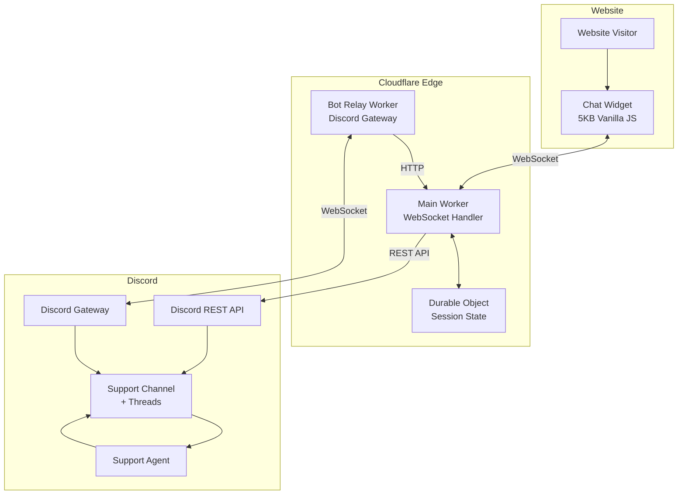

# DiscoFlare Chat

A lightweight, high-performance chat widget built with Cloudflare Workers and Discord. Achieves perfect Lighthouse scores while providing real-time communication capabilities.

## Why DiscoFlare

Traditional chat widgets destroy website performance:
- Intercom: 400KB+ JavaScript, drops Lighthouse score
- Crisp: 200KB+ JavaScript, multiple render-blocking requests
- HubSpot: Heavy tracking scripts, poor Core Web Vitals
- Tawk.to: Slow load times, aggressive resource loading

DiscoFlare solution: 3.4KB gzipped (12.3KB minified), zero third-party scripts, perfect performance.

## Features

- Perfect Performance: 3.4KB gzipped vs 200KB+ alternatives (98%+ reduction)
- Real-time Communication: WebSocket-based bidirectional messaging
- Session Persistence: Automatic reconnection and thread reuse
- Spam Protection: Cloudflare Turnstile integration
- Discord Integration: Support team uses familiar Discord interface
- Global Edge Network: Cloudflare Workers run worldwide with zero cold starts
- Cost Effective: Free tier sufficient for most sites, ~$1/month at scale
- Customizable: Full theme and text customization
- Mobile Friendly: Responsive design, works on all devices
- Secure: Input validation, rate limiting, CORS protection

## Performance Comparison

| Metric | Before (Intercom) | After (DiscoFlare) | Improvement |
|--------|-------------------|-------------------|-------------|
| Lighthouse Score | 74 | 100 | +35% |
| First Contentful Paint | 1.6s | 0.8s | 50% faster |
| Total Blocking Time | 310ms | 0ms | 100% reduction |
| Transfer Size (gzipped) | 400KB+ | 3.4KB | 99% smaller |
| Minified Size | 400KB+ | 12.3KB | 97% smaller |
| Third-party Requests | 12+ | 0 | 100% reduction |

## Architecture



### How It Works

1. **Visitor Opens Chat**: Widget establishes WebSocket connection to Cloudflare Worker
2. **Session Creation**: Worker creates or reuses Discord thread based on email
3. **Message Flow**: 
   - Visitor → Widget → Worker → Discord Thread
   - Agent → Discord → Bot Relay → Worker → Widget → Visitor
4. **Persistence**: Sessions stored in Durable Objects, survive reconnections
5. **Thread Reuse**: Returning visitors (within 90 days) continue previous conversations

## Quick Start

### Prerequisites

- Cloudflare account (free tier works)
- Discord server with admin access
- Node.js 18+ and npm
- Wrangler CLI: `npm install -g wrangler`

### 1. Discord Setup

1. Create Discord application at https://discord.com/developers/applications
2. Create bot user and copy token
3. Enable **Message Content Intent** in bot settings
4. Invite bot to your server with these permissions:
   - Read Messages/View Channels
   - Send Messages
   - Create Public Threads
   - Send Messages in Threads
   - Read Message History
5. Copy your support channel ID (enable Developer Mode in Discord)

### 2. Cloudflare Turnstile Setup

1. Go to https://dash.cloudflare.com/ → Turnstile
2. Create new site
3. Copy Site Key (public) and Secret Key (private)

### 3. Clone and Install

```bash
git clone https://github.com/zehjotkah/discoflare-chat.git
cd cloudflare-discord-chat
npm install
```

### 4. Configure and Deploy

```bash
# Authenticate with Cloudflare
wrangler login

# Set secrets for main worker
cd workers/main-worker
wrangler secret put DISCORD_BOT_TOKEN
wrangler secret put DISCORD_SUPPORT_CHANNEL_ID
wrangler secret put TURNSTILE_SECRET_KEY
wrangler secret put BOT_RELAY_SECRET  # Generate with: openssl rand -hex 32
wrangler secret put ALLOWED_ORIGINS   # e.g., https://example.com

# Deploy main worker
npm run deploy

# Set secrets for bot relay
cd ../bot-relay
wrangler secret put DISCORD_BOT_TOKEN
wrangler secret put BOT_RELAY_SECRET  # Same as main worker
wrangler secret put MAIN_WORKER_URL   # URL from main worker deployment

# Deploy bot relay
npm run deploy
cd ../..
```

### 5. Add to Your Website

```html
<!-- Add Turnstile -->
<script src="https://challenges.cloudflare.com/turnstile/v0/api.js" async defer></script>

<!-- Add Chat Widget -->
<link rel="stylesheet" href="https://your-cdn.com/chat-widget.min.css">
<script src="https://your-cdn.com/chat-widget.min.js"></script>
<script>
  window.CloudflareChat = {
    workerUrl: 'https://your-worker.workers.dev',
    turnstileSiteKey: 'your-turnstile-site-key',
    theme: {
      primaryColor: '#5865F2',
      position: 'bottom-right'
    }
  };
</script>
```

## Project Structure

```
cloudflare-chat/
├── widget/                      # Chat widget (frontend)
│   ├── chat-widget.js          # Main widget code (~300 lines)
│   ├── chat-widget.css         # Widget styles
│   └── chat-widget.min.js      # Minified version
├── workers/
│   ├── main-worker/            # Main Cloudflare Worker
│   │   ├── src/
│   │   │   ├── index.ts        # Worker entry point
│   │   │   ├── session.ts      # Durable Object (session management)
│   │   │   ├── discord.ts      # Discord API client
│   │   │   └── types.ts        # TypeScript types
│   │   ├── wrangler.toml       # Cloudflare configuration
│   │   └── package.json
│   └── bot-relay/              # Discord bot relay Worker
│       ├── src/
│       │   ├── index.ts        # Bot relay entry
│       │   ├── gateway.ts      # Discord Gateway client
│       │   └── types.ts
│       ├── wrangler.toml
│       └── package.json
├── examples/                    # Integration examples
│   ├── basic.html              # Simple integration
│   ├── custom-styling.html     # Custom theme
│   └── spa-integration.html    # SPA integration
├── docs/                        # Documentation
│   ├── setup-discord.md
│   ├── deploy-cloudflare.md
│   ├── configuration.md
│   └── api-reference.md
├── plans/                       # Architecture plans
│   ├── architecture.md
│   ├── implementation-guide.md
│   └── deployment-guide.md
├── scripts/
│   ├── deploy.sh               # Deployment script
│   └── build-widget.sh         # Widget build script
└── README.md
```

## Customization

### Theme Options

```javascript
window.CloudflareChat = {
  workerUrl: 'https://your-worker.workers.dev',
  turnstileSiteKey: 'your-key',
  
  theme: {
    primaryColor: '#5865F2',      // Brand color
    position: 'bottom-right',      // 'bottom-right' | 'bottom-left'
    buttonSize: 60,                // Button diameter (px)
    zIndex: 9999,                  // CSS z-index
    borderRadius: 12,              // Chat window border radius
    fontFamily: 'system-ui',       // Font family
  },
  
  text: {
    buttonLabel: 'Chat with us',
    headerTitle: 'Support Chat',
    placeholder: 'Type your message...',
    sendButton: 'Send',
    welcomeMessage: 'Hello! How can we help you today?',
  },
  
  autoOpen: false,                 // Auto-open on page load
  showOnMobile: true,              // Show on mobile
  persistSession: true,            // Remember session
};
```

### Custom Styling

Override CSS variables:

```css
:root {
  --chat-primary-color: #your-brand-color;
  --chat-bg-color: #ffffff;
  --chat-text-color: #2c2f33;
  --chat-border-radius: 12px;
  --chat-shadow: 0 4px 12px rgba(0, 0, 0, 0.15);
}
```

## Security Features

- **Cloudflare Turnstile**: Invisible CAPTCHA prevents spam
- **Input Validation**: Message length limits, email validation, XSS prevention
- **Rate Limiting**: 10 messages/minute per session, 3 sessions/hour per IP
- **CORS Protection**: Whitelist allowed origins
- **Authentication**: Bot relay uses shared secret
- **Secure Storage**: All tokens stored as Cloudflare secrets

## Monitoring

### View Real-time Logs

```bash
# Main worker logs
cd workers/main-worker
wrangler tail

# Bot relay logs
cd workers/bot-relay
wrangler tail
```

### Cloudflare Analytics

1. Go to Cloudflare dashboard
2. Navigate to Workers & Pages
3. Select your worker
4. View metrics: requests, errors, CPU time, duration

### Discord Notifications

Set up Discord webhooks for error alerts (optional enhancement).

## Cost Breakdown

### Cloudflare Workers (Free Tier)
- 100,000 requests/day
- Sufficient for most small-medium websites

### Cloudflare Workers (Paid)
- $5/month base
- $0.50 per million requests
- Durable Objects: $0.15 per million requests

### Expected Monthly Costs

| Traffic | Chat Usage | Cost |
|---------|-----------|------|
| 1,000 visitors/day | 5% (50 chats) | **Free** |
| 10,000 visitors/day | 5% (500 chats) | **Free - $1** |
| 100,000 visitors/day | 5% (5,000 chats) | **$5-10** |

**Discord**: Free for this use case  
**Turnstile**: Free (included with Cloudflare)

## Testing

### Run Tests

```bash
# Unit tests
npm test

# Integration tests
npm run test:integration

# Load tests
npm run test:load
```

### Manual Testing Checklist

- [ ] Chat button appears on website
- [ ] Click opens chat window
- [ ] Name and email form validation works
- [ ] Messages send to Discord thread
- [ ] Agent responses appear in widget
- [ ] Session persists after page refresh
- [ ] Reconnection works after disconnect
- [ ] Mobile responsive design works
- [ ] Turnstile verification works
- [ ] Rate limiting prevents spam

## Troubleshooting

### Chat button doesn't appear
- Check browser console for errors
- Verify widget script is loading
- Check CORS settings in worker

### "Failed to verify CAPTCHA"
- Verify Turnstile site key is correct
- Check Turnstile secret key in worker
- Ensure domain is added to Turnstile site

### Messages not appearing in Discord
- Verify bot token is correct
- Check bot has proper permissions
- Verify channel ID is correct
- Check worker logs: `wrangler tail`

### Agent responses not appearing
- Verify bot relay is running
- Check bot relay has correct MAIN_WORKER_URL
- Verify BOT_RELAY_SECRET matches
- Check bot relay logs

See [`plans/deployment-guide.md`](plans/deployment-guide.md) for detailed troubleshooting.

## Documentation

- **[Architecture Plan](plans/architecture.md)** - System design and technical details
- **[Implementation Guide](plans/implementation-guide.md)** - Step-by-step implementation
- **[Deployment Guide](plans/deployment-guide.md)** - Complete deployment instructions
- **[API Reference](docs/api-reference.md)** - WebSocket protocol and API docs
- **[Configuration](docs/configuration.md)** - All configuration options

## Roadmap

### Phase 2 (Planned)
- [ ] Typing indicators
- [ ] File upload support
- [ ] Emoji reactions
- [ ] Agent status (online/offline)
- [ ] Canned responses

### Phase 3 (Future)
- [ ] Multi-language support
- [ ] Chat transcripts via email
- [ ] Analytics dashboard
- [ ] Custom branding per domain
- [ ] Agent assignment rules

### Advanced Features
- [ ] AI-powered auto-responses
- [ ] Sentiment analysis
- [ ] Chat routing based on page context
- [ ] Integration with Slack/Teams
- [ ] Voice/video chat support

## Contributing

Contributions are welcome! Please:

1. Fork the repository
2. Create a feature branch: `git checkout -b feature/amazing-feature`
3. Commit changes: `git commit -m 'Add amazing feature'`
4. Push to branch: `git push origin feature/amazing-feature`
5. Open a Pull Request

### Development Setup

```bash
# Clone repo
git clone https://github.com/yourusername/cloudflare-discord-chat.git
cd cloudflare-discord-chat

# Install dependencies
npm install

# Run main worker locally
cd workers/main-worker
npm run dev

# Run bot relay locally (separate terminal)
cd workers/bot-relay
npm run dev
```

## License

MIT License - see [LICENSE](LICENSE) file for details.

## Support

- **Issues**: [GitHub Issues](https://github.com/yourusername/cloudflare-discord-chat/issues)
- **Discussions**: [GitHub Discussions](https://github.com/yourusername/cloudflare-discord-chat/discussions)
- **Email**: support@example.com

---

Built for performance-conscious developers who need real-time communication without sacrificing website speed.
