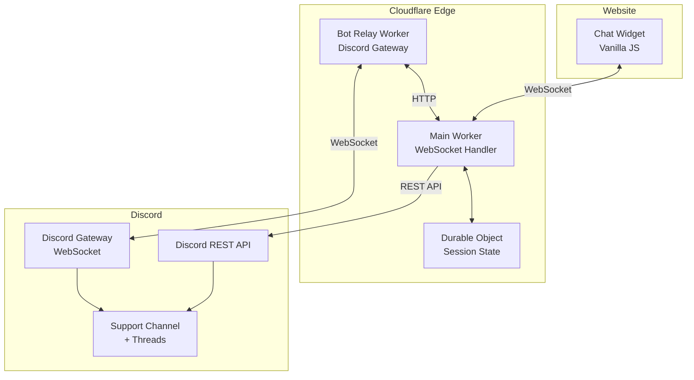

# Cloudflare-Discord Chat Widget - Architecture Plan

## Project Overview

A lightweight, high-performance chat widget system that achieves perfect Lighthouse scores by replacing bloated third-party solutions with a custom implementation using:
- **Frontend**: Vanilla JavaScript/HTML/CSS widget (~5KB)
- **Backend**: Cloudflare Workers with Durable Objects
- **Communication**: Discord as the support team interface
- **Security**: Cloudflare Turnstile for spam prevention

## Design Goals

1. **Performance First**: Minimal bundle size, zero third-party scripts, perfect Lighthouse scores
2. **Easy Deployment**: One-click Cloudflare deployment with simple configuration
3. **Real-time Communication**: WebSocket-based bidirectional messaging
4. **Session Persistence**: Automatic reconnection and thread reuse
5. **Developer Friendly**: Framework-agnostic, simple integration

## System Architecture



## Component Breakdown

### 1. Chat Widget (Frontend)

**File**: `widget/chat-widget.js`

**Responsibilities**:
- Render floating chat button and window
- Establish WebSocket connection to Cloudflare Worker
- Handle user input (name, email, messages)
- Display incoming messages from support agents
- Manage local session state (localStorage)
- Implement automatic reconnection logic
- Integrate Cloudflare Turnstile verification

**Key Features**:
- Pure vanilla JavaScript (no dependencies)
- Customizable styling via CSS variables
- Responsive design (mobile-friendly)
- Accessibility compliant (ARIA labels, keyboard navigation)
- Session restoration after page refresh
- Connection status indicators

**Bundle Size Target**: ~5KB minified

**Configuration**:
```javascript
window.CloudflareChat = {
  workerUrl: 'https://chat.example.workers.dev',
  turnstileSiteKey: 'your-turnstile-key',
  theme: {
    primaryColor: '#5865F2',
    position: 'bottom-right'
  }
};
```

### 2. Main Cloudflare Worker

**File**: `workers/main-worker/src/index.ts`

**Responsibilities**:
- Handle WebSocket upgrade requests
- Route connections to appropriate Durable Objects
- Validate CORS and origin restrictions
- Process Turnstile tokens
- Create and manage Discord threads
- Send messages to Discord via REST API
- Receive messages from bot relay and forward to clients

**API Endpoints**:

```typescript
// WebSocket upgrade
GET /ws
Headers: Upgrade: websocket

// Health check
GET /health

// Receive messages from bot relay
POST /relay
Body: { threadId, message, author }
```

**Environment Variables**:
```
DISCORD_BOT_TOKEN=your_bot_token
DISCORD_SUPPORT_CHANNEL_ID=channel_id
TURNSTILE_SECRET_KEY=secret_key
ALLOWED_ORIGINS=https://example.com,https://www.example.com
BOT_RELAY_SECRET=shared_secret_for_relay
```

### 3. Durable Object (Session Manager)

**File**: `workers/main-worker/src/session.ts`

**Responsibilities**:
- Maintain WebSocket connection state
- Store session metadata (name, email, threadId)
- Handle message routing between client and Discord
- Implement session timeout and cleanup
- Support hibernation for cost efficiency

**State Schema**:
```typescript
interface SessionState {
  sessionId: string;
  email: string;
  name: string;
  threadId: string;
  createdAt: number;
  lastActivity: number;
  messageHistory: Message[];
}
```

**Session Lifecycle**:
1. Client connects → Create or restore session
2. Init message → Lookup or create Discord thread
3. Messages flow → Route between client and Discord
4. Disconnect → Persist state, set timeout
5. Reconnect (within 1 hour) → Restore session
6. Timeout (after 1 hour) → Archive session

### 4. Discord Bot Relay Worker

**File**: `workers/bot-relay/src/index.ts`

**Responsibilities**:
- Maintain persistent connection to Discord Gateway
- Listen for messages in support threads
- Filter and process agent responses
- Forward messages to main Worker via HTTP
- Handle Discord Gateway events (reconnection, heartbeat)

**Discord Gateway Events**:
- `READY` - Bot connected
- `MESSAGE_CREATE` - New message in thread
- `THREAD_UPDATE` - Thread status changes

**Message Flow**:
```
Discord Thread Message
  → Gateway Event
  → Bot Relay processes
  → HTTP POST to Main Worker
  → Durable Object routes to client
  → WebSocket sends to browser
```

### 5. Discord Integration

**Thread Management**:
- Create public threads in designated support channel
- Thread naming: `Support: {userName} - {email}`
- Auto-archive after 60 minutes of inactivity
- Thread reuse within 90 days based on email

**Message Format**:
```
[Visitor Name] (email@example.com)
Page: /pricing
---
User message content here
```

**Required Bot Permissions**:
- Read Messages/View Channels
- Send Messages
- Create Public Threads
- Send Messages in Threads
- Read Message History

## WebSocket Protocol

### Client → Server Messages

**Initialize Session**:
```json
{
  "type": "init",
  "data": {
    "name": "John Doe",
    "email": "john@example.com",
    "page": "/pricing",
    "turnstileToken": "token_here"
  }
}
```

**Send Message**:
```json
{
  "type": "message",
  "data": {
    "message": "I need help with pricing"
  }
}
```

**Ping** (keep-alive):
```json
{
  "type": "ping"
}
```

### Server → Client Messages

**Ready State**:
```json
{
  "type": "ready",
  "data": {
    "message": "Connected to support. An agent will be with you shortly.",
    "sessionId": "uuid"
  }
}
```

**Incoming Message**:
```json
{
  "type": "message",
  "data": {
    "message": "Hello! How can I help you?",
    "author": "Support Agent",
    "timestamp": 1234567890
  }
}
```

**Error**:
```json
{
  "type": "error",
  "data": {
    "message": "Failed to verify Turnstile token"
  }
}
```

**Pong** (keep-alive response):
```json
{
  "type": "pong"
}
```

## Security Measures

### 1. Cloudflare Turnstile Integration
- Invisible challenge before chat initialization
- Token validation on Worker side
- Prevents automated spam and abuse

### 2. Input Validation
- Message length limits (max 2000 characters)
- Email format validation
- Name sanitization (remove special characters)
- XSS prevention (escape HTML in messages)

### 3. Rate Limiting
- Max 10 messages per minute per session
- Max 3 new sessions per IP per hour
- Implemented via Durable Object state

### 4. CORS Protection
- Whitelist allowed origins
- Validate Origin header on WebSocket upgrade
- Reject unauthorized domains

### 5. Authentication
- Bot relay uses shared secret for Worker communication
- Discord bot token stored as environment variable
- No sensitive data exposed to client

## Session Management

### Thread Reuse Logic

```typescript
async function findExistingThread(email: string): Promise<string | null> {
  // Search threads in support channel
  // Match by email in thread name or first message
  // Check if thread is less than 90 days old
  // Return threadId if found, null otherwise
}
```

### Reconnection Strategy

**Client-side**:
1. Store sessionId in localStorage
2. On disconnect, attempt reconnection with exponential backoff
3. Intervals: 2s, 4s, 8s, 16s (max)
4. Include sessionId in reconnection init message

**Server-side**:
1. Validate sessionId exists in Durable Object
2. Check session age (max 1 hour)
3. Restore WebSocket connection to existing session
4. Send message history since disconnect

### Session Cleanup

- Active sessions: Keep alive with ping/pong
- Disconnected sessions: 1-hour grace period
- Expired sessions: Archive to KV storage (optional)
- Thread archiving: Discord auto-archives after 60 minutes

## Deployment Architecture

### Project Structure

```
cloudflare-chat/
├── widget/
│   ├── chat-widget.js          # Main widget code
│   ├── chat-widget.css         # Widget styles
│   └── chat-widget.min.js      # Minified version
├── workers/
│   ├── main-worker/
│   │   ├── src/
│   │   │   ├── index.ts        # Worker entry point
│   │   │   ├── session.ts      # Durable Object
│   │   │   ├── discord.ts      # Discord API client
│   │   │   └── types.ts        # TypeScript types
│   │   ├── wrangler.toml       # Cloudflare config
│   │   ├── package.json
│   │   └── tsconfig.json
│   └── bot-relay/
│       ├── src/
│       │   ├── index.ts        # Bot relay entry
│       │   ├── gateway.ts      # Discord Gateway client
│       │   └── types.ts
│       ├── wrangler.toml
│       ├── package.json
│       └── tsconfig.json
├── examples/
│   ├── basic.html              # Simple integration example
│   ├── custom-styling.html     # Custom theme example
│   └── spa-integration.html    # SPA integration example
├── docs/
│   ├── setup-discord.md        # Discord bot setup guide
│   ├── deploy-cloudflare.md    # Cloudflare deployment guide
│   ├── configuration.md        # Configuration options
│   └── api-reference.md        # API documentation
├── scripts/
│   ├── deploy.sh               # Deployment script
│   └── build-widget.sh         # Widget build script
├── .github/
│   └── workflows/
│       └── deploy.yml          # CI/CD pipeline
├── README.md
├── LICENSE
└── package.json
```

### Deployment Steps

1. **Discord Setup**:
   - Create Discord application
   - Create bot and get token
   - Enable required intents (Guild Messages, Message Content)
   - Invite bot to server with permissions
   - Note support channel ID

2. **Cloudflare Setup**:
   - Install Wrangler CLI
   - Authenticate with Cloudflare account
   - Configure wrangler.toml files
   - Set environment variables (secrets)

3. **Deploy Workers**:
   ```bash
   # Deploy main worker
   cd workers/main-worker
   npm install
   npm run deploy
   
   # Deploy bot relay
   cd ../bot-relay
   npm install
   npm run deploy
   ```

4. **Widget Integration**:
   ```html
   <!-- Add to website -->
   <script src="https://your-cdn.com/chat-widget.min.js"></script>
   <script>
     window.CloudflareChat = {
       workerUrl: 'https://chat.your-domain.workers.dev',
       turnstileSiteKey: 'your-key'
     };
   </script>
   ```

### One-Click Deployment (Future Enhancement)

Create a deployment template using:
- Cloudflare Workers Deploy Button
- Pre-configured wrangler.toml templates
- Interactive setup wizard for environment variables
- Automated Discord bot creation via OAuth flow

## Performance Optimizations

### Widget Optimizations
- Lazy load chat window (only button initially)
- Defer non-critical CSS
- Use CSS containment for chat window
- Minimize DOM operations
- Debounce typing indicators

### Worker Optimizations
- Use Durable Object hibernation
- Cache Discord API responses
- Batch message sends when possible
- Minimize cold start impact
- Use Workers KV for read-heavy data

### Network Optimizations
- WebSocket compression
- Message batching for high-frequency updates
- CDN delivery for widget assets
- HTTP/2 for API calls

## Monitoring and Observability

### Metrics to Track
- WebSocket connection count
- Message throughput
- Session duration
- Reconnection rate
- Error rate by type
- Discord API latency

### Logging Strategy
- Client errors → Worker logs
- Worker errors → Cloudflare Analytics
- Discord API errors → Separate log stream
- Session lifecycle events

### Alerting
- High error rate
- Discord API failures
- Worker CPU/memory limits
- Unusual traffic patterns

## Cost Estimation

### Cloudflare Workers
- Free tier: 100,000 requests/day
- Paid: $5/month + $0.50 per million requests
- Durable Objects: $0.15 per million requests

### Expected Costs (1000 daily visitors, 10% chat usage)
- 100 chat sessions/day
- ~1000 messages/day
- Estimated: **Free tier sufficient** or <$1/month

### Discord
- Free for this use case
- No API rate limit concerns at this scale

## Testing Strategy

### Unit Tests
- WebSocket protocol handlers
- Session state management
- Discord API client
- Message validation and sanitization

### Integration Tests
- End-to-end message flow
- Reconnection scenarios
- Thread creation and reuse
- Turnstile validation

### Load Tests
- Concurrent WebSocket connections
- Message throughput
- Durable Object performance
- Discord API rate limits

### Manual Testing
- Cross-browser compatibility
- Mobile responsiveness
- Network interruption handling
- Session persistence

## Future Enhancements

### Phase 2 Features
- Typing indicators
- File upload support
- Emoji reactions
- Agent status (online/offline)
- Canned responses

### Phase 3 Features
- Multi-language support
- Chat transcripts via email
- Analytics dashboard
- Custom branding per domain
- Agent assignment rules

### Advanced Features
- AI-powered auto-responses
- Sentiment analysis
- Chat routing based on page context
- Integration with other platforms (Slack, Teams)
- Voice/video chat support

## Risk Mitigation

### Potential Issues

1. **Discord API Rate Limits**
   - Mitigation: Implement request queuing and backoff
   - Monitor rate limit headers
   - Cache thread lookups

2. **WebSocket Connection Limits**
   - Mitigation: Durable Objects scale automatically
   - Implement connection pooling if needed
   - Monitor concurrent connection metrics

3. **Spam and Abuse**
   - Mitigation: Turnstile + rate limiting
   - IP-based throttling
   - Message content filtering

4. **Discord Gateway Disconnections**
   - Mitigation: Automatic reconnection in bot relay
   - Exponential backoff strategy
   - Queue messages during downtime

5. **Session State Loss**
   - Mitigation: Durable Objects persist state
   - Implement state snapshots
   - Graceful degradation

## Success Metrics

### Performance
- ✅ Lighthouse Performance Score: 100
- ✅ Widget Bundle Size: <10KB
- ✅ First Contentful Paint: <1s
- ✅ Total Blocking Time: <100ms

### Reliability
- ✅ Uptime: >99.9%
- ✅ Message delivery rate: >99%
- ✅ Successful reconnection rate: >95%

### User Experience
- ✅ Time to first response: <2 minutes
- ✅ Session restoration success: >90%
- ✅ Mobile usability score: 100

## Conclusion

This architecture provides a production-ready, scalable, and performant chat widget solution that:
- Eliminates third-party performance overhead
- Leverages existing Discord infrastructure
- Deploys easily to Cloudflare's edge network
- Maintains real-time bidirectional communication
- Costs virtually nothing to operate at small-medium scale

The modular design allows for incremental improvements and feature additions while maintaining the core performance benefits.
